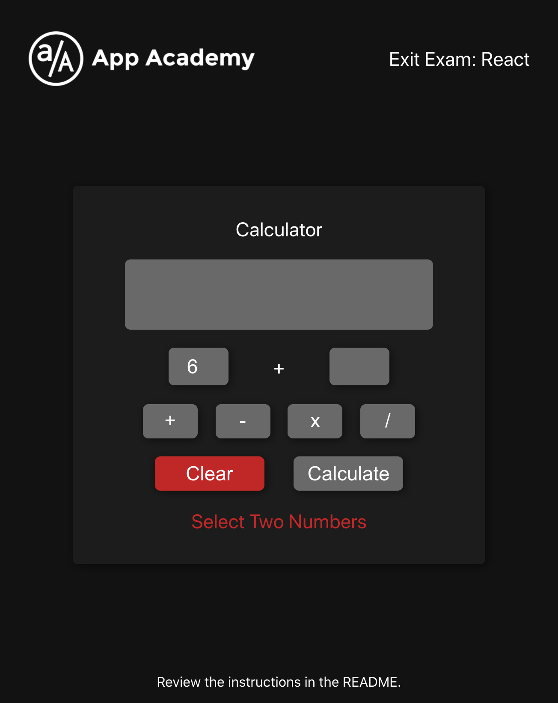

# React Assessment <!-- omit in toc -->

## Table of Contents <!-- omit in toc -->
- [Running the Project](#running-the-project)
  - [Setup](#setup)
  - [Dev Server](#dev-server)
  - [Tests](#tests)
- [Instructions](#instructions)
  - [Mock Ups](#mock-ups)

## Running the Project
### Setup
- run `npm install` to install dependencies before starting this section.
  ### Dev Server
- To run the dev server for this section, use `npm start` 

### Tests
- To run tests for this section, use `num run test`
- Press `ENTER` to re-run tests as you code.

## Instructions

For this assessment you will demonstrate your knowledge of React by completing a
simple calculator application.

The framework for this app has been provided for you as well. You will *_not_*
need to contribute any custom css or styling. 

- You may choose to build out EITHER the class component framework `CalcClass`
  or functional component framework utilizing hooks `CalcHook`
- Comment in ONLY the `export default` at the bottom of the page that
  corresponds to your chosen approach. Leaving both commented out or commented
  in simultaneously will result in a failed test.

- All code should be written in `./src/components/Calculator.js`
- When not displaying a number `input` and `display` values should be an empty
  string `''`
- `+` should be the default operator.
- If `Calculate` is attempted without 2 number inputs, `Select Two Numbers`
  should be rendered as an error message.

### Mock Ups

